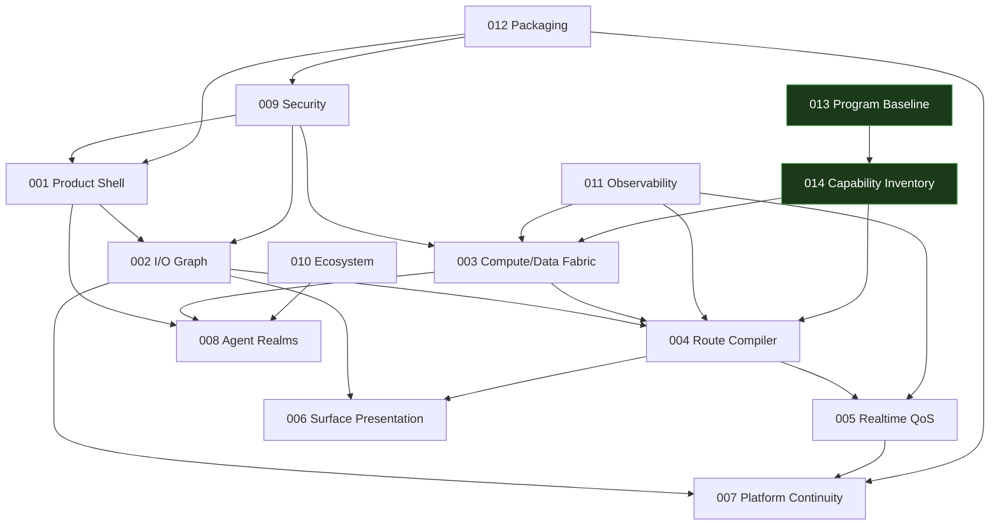

# Feature Specification Index

These feature folders follow the live AgilePlus `kitty-specs` pattern: `meta.json`, `spec.md`, `plan.md`, and `tasks.md`.

| No. | Feature ID | Title | Scope |
|---:|---|---|---|
| 001 | [`001-unified-product-shell`](001-unified-product-shell/spec.md) | Unified Product Shell and Workspace Model | Cross-platform packaged UI, CLI, SDK, installer, discovery, graph canvas, simple workspace controls |
| 002 | [`002-universal-io-graph`](002-universal-io-graph/spec.md) | Universal I/O Graph, Seats, and Focus | Typed ports, graph transactions, input/output leases, HID/MIDI/audio/video/clipboard/file endpoint semantics |
| 003 | [`003-compute-data-fabric`](003-compute-data-fabric/spec.md) | Adaptive Heterogeneous Compute and Data Fabric | Resource inventory, task/object model, placement, residency, fusion/fission, mobility, predictive prefetch |
| 004 | [`004-locality-route-compiler`](004-locality-route-compiler/spec.md) | Locality-Aware Route Compiler and Transport Plane | L0-L8 locality tiers, stage elimination, shared-memory/PCIe/LAN/WAN/OOB paths, dynamic replanning |
| 005 | [`005-realtime-qos`](005-realtime-qos/spec.md) | Real-Time QoS, Admission, and Contention Control | RT0-Bulk classes, resource reservations, Ableton/gaming protection, adaptive degradation, thermal/power policy |
| 006 | [`006-seamless-surface-presentation`](006-seamless-surface-presentation/spec.md) | Seamless Surface and Application Presentation | Full desktops, virtual monitors, semantic app remoting, native pixel proxies, window graphs, MacBook third-display workflow |
| 007 | [`007-platform-continuity-adapters`](007-platform-continuity-adapters/spec.md) | Cross-Platform Continuity, Audio, Clipboard, and Files | Linux/Windows/macOS endpoint adapters, PipeWire/JACK/CoreAudio/WASAPI, typed clipboard, file send/sync/mount, platform permissions |
| 008 | [`008-agent-ephemeral-realms`](008-agent-ephemeral-realms/spec.md) | Agent-Created Realms and Non-Stealing Surface Publication | Realm provisioning, enrollment, TTL, surface publication, attention requests, resource budgets, fallback consoles |
| 009 | [`009-security-identity-evidence`](009-security-identity-evidence/spec.md) | Security, Identity, Leases, Audit, and Evidence | Mutual identity, capability authorization, privileged helper isolation, route leases, evidence bundles, OOB isolation |
| 010 | [`010-ecosystem-integration`](010-ecosystem-integration/spec.md) | Phenotype Ecosystem Integration and Product Boundaries | AgilePlus, thegent, AGSLAG, Tracera, SessionLedger, ShareCLI, NVMS, labs-compute, event contracts |
| 011 | [`011-observability-verification`](011-observability-verification/spec.md) | Observability, Benchmarking, and Verification | Measurement boundaries, telemetry, benchmark harness, fault injection, compatibility, evidence |
| 012 | [`012-packaging-operations`](012-packaging-operations/spec.md) | Packaging, Deployment, Upgrade, and Recovery | Cross-platform install, signed components, configuration, coordinator topology, updates, rollback, diagnostics, OOB recovery |
| 013 | [`013-fabric-program-baseline`](013-fabric-program-baseline/spec.md) | Fabric Program Baseline (R0 Foundation) | Product boundary freeze, identifier normalization, documentation-as-code checks, source-confidence policy, release evidence contract. Unblocks all other WPs. |
| 014 | [`014-capability-inventory`](014-capability-inventory/spec.md) | Capability Inventory and Topology Probe | Detect, classify, sign, and publish graph-native capability descriptor: CPU/NUMA/cache, GPU/NPU/codec/display/PCIe, audio/MIDI/input/storage/NIC, link metrics. First R0 runtime code. |
| 015 | [`015-route-compiler-cli`](015-route-compiler-cli/spec.md) | Route Compiler and Reference CLI | Canonical graph objects (node/port/link/domain), capability/format negotiation, prepare/commit/abort/rollback, lease/fencing, workspace snapshots, recursion/hop prevention, reference CLI and JSON-RPC. R1. |
| 016 | [`016-nvms-manifest-adapter`](016-nvms-manifest-adapter/spec.md) | NVMS Manifest Adapter (R0.5) | Map odin.nvms v0.2 application manifests to Fabric `CapabilityDescriptor`. Path dep on archived nanovms `phenotype-manifest`. R0.5 → R1. |
| 017 | [`017-workspace-persistence`](017-workspace-persistence/spec.md) | Workspace Persistence (lease FSM + JSON store) | Per-user workspace state, seat-lease FSM, JSON file persistence, conflict detection. Source preserved untracked. R1. |
| 018 | [`018-fabric-checker-pf-wp-011`](018-fabric-checker-pf-wp-011/spec.md) | Fabric Checker (probe vs NVMS cross-check) | Cross-check Fabric capability probe against NVMS manifest requirements before workspace creation. Decision taxonomy (Admit/AdmitWithNotes/Reject) + reason codes. Source preserved untracked. R1. |
| 019 | [`019-surface-plane`](019-surface-plane/spec.md) | Surface Plane (PF-WP-015) | Declarative `SurfaceSpec`, route binding, lease FSM (Pending/Active/Completed/Failed/Revoked/Expired), surface ops (bind/fail/revoke/expire). Stable per ADR-0027. R1. |
| 020 | [`020-route-lease-integration`](020-route-lease-integration/spec.md) | Route Lease Integration (PF-WP-022) | The single integration entry point `rebind_or_fail` that ties failover::replan (ADR-0030) to the surface plane (spec 019). Strict-epoch-binding enforcement. `cmd/checker -failover-blacklist` ratified as the operator-facing half. R1. |
| 021 | [`021-trust-root-descriptor-signatures`](021-trust-root-descriptor-signatures/spec.md) | Trust-Root Model for Descriptor Signatures (PF-WP-016) | Single trust-root anchors an optional 2-level authority chain over CapabilityDescriptor signatures; signed RevocationList catches compromised keys; bounded chain depth (cap = 2). Closes the R0 "no revocation" risk. ADR-0031 Accepted. R1. |

## R0.5 / R1 (intermediate work packages)

These work packages ship after R0 (capability inventory) and before the full feature set, providing the minimum runtime infrastructure needed for surface presentation and agent work.

| WP | Spec | Title | Release gate |
|---|---|---|---|
| PF-WP-020 | [`015-route-compiler-cli`](015-route-compiler-cli/spec.md) | Route Compiler + CLI | R1 |
| PF-WP-011 | [`016-nvms-manifest-adapter`](016-nvms-manifest-adapter/spec.md) | NVMS Adapter | R0.5 |
| PF-WP-022 | [`017-workspace-persistence`](017-workspace-persistence/spec.md) | Workspace Persistence (lease FSM + JSON store) | R1 |

## R0 Program Baselines (work packages PF-WP-000 and PF-WP-010)

The two R0 work packages are program-level infrastructure and runtime
foundations. They do not implement feature behavior — they create the
contracts that all subsequent WPs depend on.

| WP | Spec | Title | Release gate |
|---|---|---|---|
| PF-WP-000 | [`013-fabric-program-baseline`](013-fabric-program-baseline/spec.md) | Program Baseline | R0 → R1 |
| PF-WP-010 | [`014-capability-inventory`](014-capability-inventory/spec.md) | Capability Inventory | R0 → R1 |

## Dependency spine

